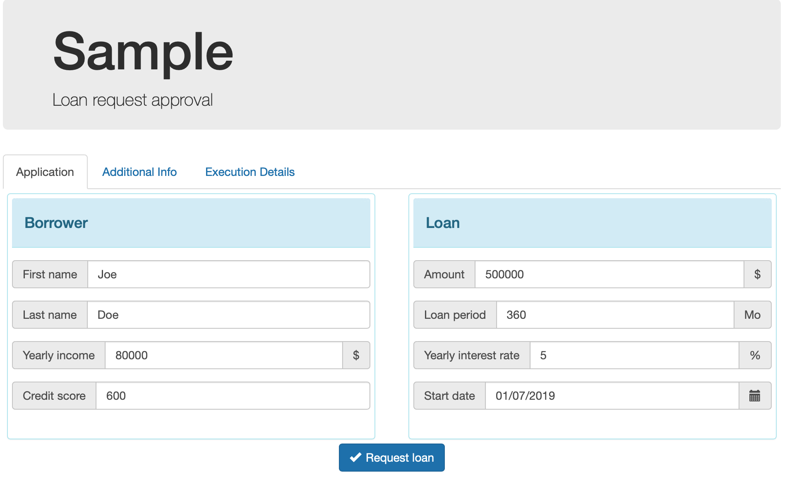
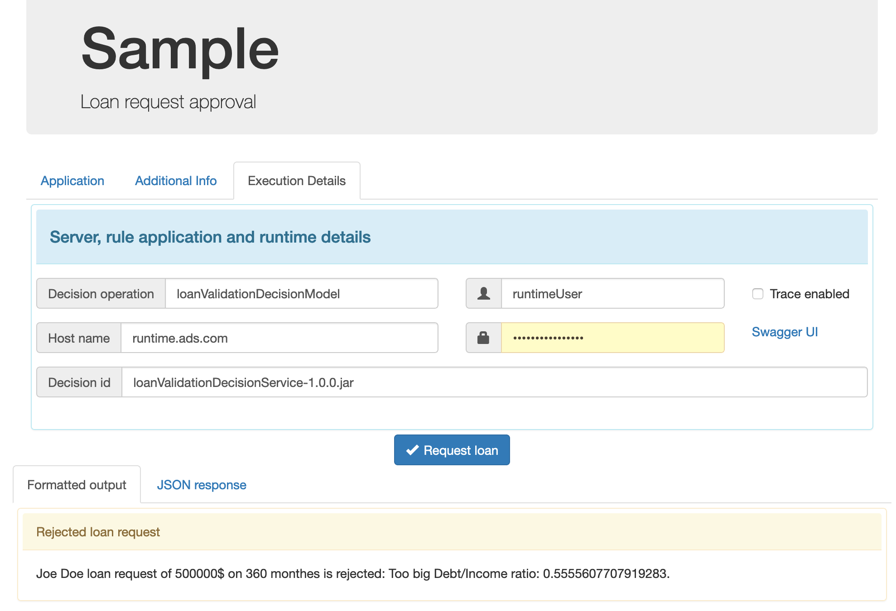

# Sample: Loan Validation application

## Description
This sample uses a web application to call a decision service that is built from a decision project. You import the project into Automation Decision Services, and publish it to a Git repository. Then, you make the decision service archive from the project in a CI/CD stack, and deploy it to a runtime environment. Finally, you build and run the web-based client application, which calls the decision service to process loan requests. 

## Learning objectives
- Publish a decision project to a production environment.
- Generate a decision service archive from the decision project.
- Configure a web application to use the decision service.
- Run the web application with representative data.
- Explore the execution trace.

## Audience

This sample is for anyone who wants to run a decision service that is generated from a decision project published from Automation Decision Services.

## Time required

10 minutes

## Prerequisites
- Automation Decision Services: Your instance of the services must have a runtime that supports basic authentication. You must have the host name and login credentials (user name and password) to call the runtime.
- Websphere Application Server Liberty: A Java application server that you can download from [Download WAS Liberty](https://developer.ibm.com/wasdev/downloads/). This sample was tested on **WAS Liberty with Java EE 8 Full Platform V20.0.0.6**.
- Apache Maven: A software project management tool that you can download from [Welcome to Apache Maven](https://maven.apache.org).

It is recommended that you do the tutorial [Getting started in Automation Decision Services](https://www.ibm.com/support/knowledgecenter/SSYHZ8_20.0.x/com.ibm.dba.aid/gs_ddesigner_topics/dba_ddesigner_intro.html) before using this sample.

# Setting up the sample
## Deploying the decision service
If you have an instance of Automation Decision Services that was installed from the demo pattern, you can skip this setup step. Your runtime is already configured to call the archive on GitHub. Its decision ID is `loanValidationDecisionService-1.0.0.jar`.

Otherwise, you must deploy the Loan Validation decision service by using an instance of Automation Decision Services that is connected to a CI/CD stack.

To deploy the decision service:

1. Import the Banking sample into a new decision solution in Automation Decision Services (see [Importing decision projects](https://www.ibm.com/support/knowledgecenter/SSYHZ8_20.0.x/com.ibm.dba.aid/topics/tsk_import_projects.html)).
2. Connect your solution to a Git repository (see [Connecting a decision solution to a remote Git repository](https://www.ibm.com/support/knowledgecenter/SSYHZ8_20.0.x/com.ibm.dba.aid/topics/tsk_enabling_collaboration.html)). 
3. Publish all the pending changes for the Loan Validation project (see [Publishing changes](https://www.ibm.com/support/knowledgecenter/SSYHZ8_20.0.x/com.ibm.dba.aid/topics/tsk_collab_publish.html)).
4. Build the decision service archive and deploy it to your runtime repository (see [Building and deploying decision services](https://www.ibm.com/support/knowledgecenter/SSYHZ8_20.0.x/com.ibm.dba.aid/topics/tsk_build_deploy.html)).
5. Get the decision ID of the decision service archive.

## Building and deploying the client application
In this step, you download the repository for the sample application, set properties to match your Automation Decision Services runtime, and build the application WAR file.

1. Download a compressed file of the `automation-decision-services-samples` Git repository.
2. Edit the following values in the file `samples/LoanApplication/src/main/webapp/resources/config.js`:
   - **SERVERNAME**: The name of the host server on which you run the Automation Decision Services runtime, for example, `runtime.ads.com`.
   - **DECISIONID**: The decision ID of the loanValidation decision service that is deployed on your Automation Decision Services runtime repository.
   - **ADSUSERNAME** and **ADSPASSWORD**: The credentials for your Automation Decision Services runtime.

   These values are used by default in the user interface of the loan application.
3. Edit the file `samples/LoanApplication/pom.xml` to set the property `<liberty-path>` to the path of your Liberty application server.
4. Run the following command in the `samples/LoanApplication` directory:
```
mvn clean install
```
 The command:
 
 - Creates the client application WAR file.
 - Creates and starts a Liberty server.
 - Deploys the client application to the server.

You can use the application when you see the message ``` BUILD SUCCESS```.

**Note:** If you want to modify and build the application again, follow the instructions in the section [Clean this sample](https://github.ibm.com/dba/automation-decision-services-samples/tree/master/samples/LoanApplication#clean-this-sample) at the end of this readme.

# Sample details
1. In a browser, open the URL ```http://localhost:9080/loanApplication-1.0-SNAPSHOT/```:



2. Switch to the Execution Details tab.
3. Check that the values for the server name, user name, password, and decision ID are the same as the ones you entered in the config.js file.
4. Click **Request loan**, and look at the results. You can switch to the JSON response to get the full JSON output:



5. Select **Trace Enabled**, and click **Request loan** again to get more details on the execution trace. You can vary the input values to change the results. For example, in the Application tab, if you change the amount to 2000000, you get the message ``` The loan cannot exceed 1000000.```
6. In the Execution Details tab, you can use the Swagger UI link to open the Swagger REST API to the Automation Decision Services runtime. There you can change the trace parameters.

# Clean this sample

Follow these instructions to rebuild the sample.

1.  To stop the Liberty server, run the following command in the `samples/LoanApplication` directory:
```
mvn liberty:stop -DserverName=testADS -DserverHome=<path to Liberty> 
```
To remove the Liberty server, delete the directory ```<path to Liberty>/usr/servers/testADS```.

Now, you can rebuild the sample by again running the following command in the `samples/LoanApplication` directory:
   ```
   mvn clean install
   ```         
            
